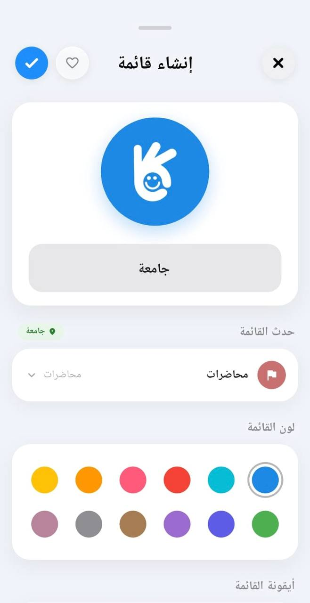
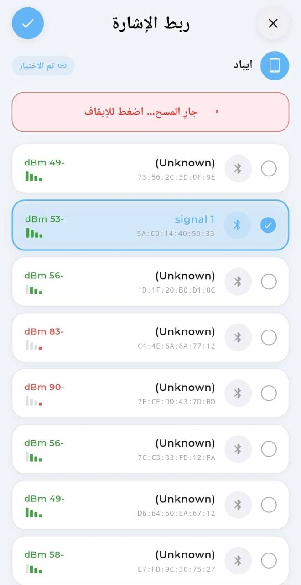
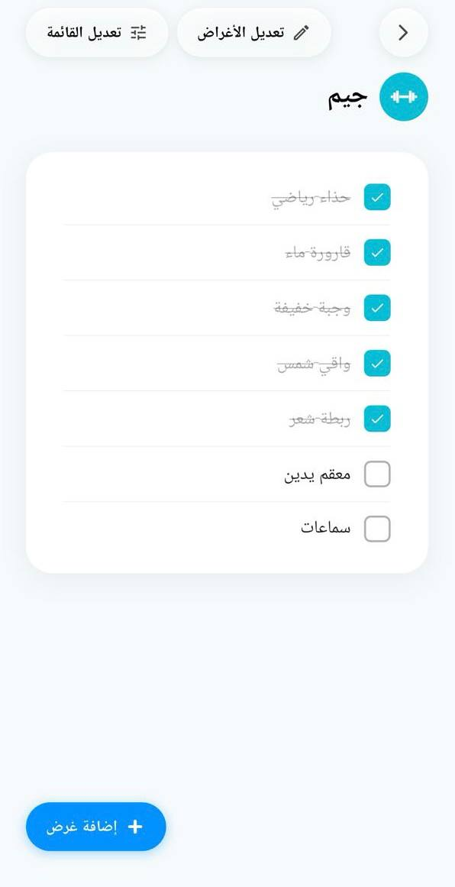
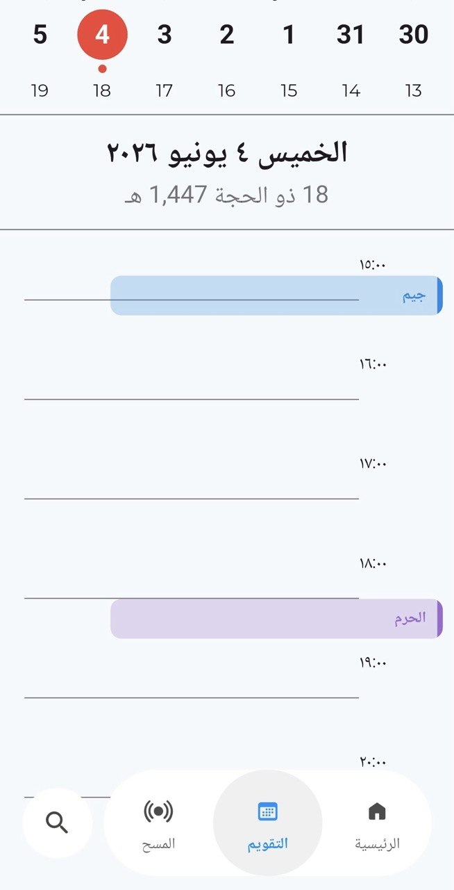

# Tawakad (توكد)

Tawakad is a cross-platform Flutter mobile app that helps users prepare for different destinations by creating smart packing lists, receiving AI-based item suggestions, scanning BLE-tagged belongings, viewing scheduled lists in a calendar, and earning rewards after completing lists.

The app is built with Flutter, Firebase, BLE scanning, and a FastAPI AI backend.

---

## Run Instructions

### 1. Install Flutter packages

```bash
flutter pub get
```

### 2. Start the AI backend

From the project root:

```bash
cd toki_backend
uvicorn app:app --reload --host 0.0.0.0 --port 8000
```

Keep the backend running while testing AI recommendations.

### 3. Set the correct backend URL

| Running on       | Use                          |
| ---------------- | ---------------------------- |
| Chrome           | `http://127.0.0.1:8000`      |
| Android Emulator | `http://10.0.2.2:8000`       |
| Physical Phone   | `http://YOUR_LAPTOP_IP:8000` |

For a physical phone, the laptop and phone must be connected to the same Wi-Fi.

To find your laptop IP on Windows:

```bash
ipconfig
```

Use the IPv4 address from the Wi-Fi adapter.

### 4. Run the Flutter app

```bash
flutter run
```

For Chrome testing:

```bash
flutter run -d chrome
```

Chrome is useful for UI testing, but a physical phone is needed to test BLE scanning and full mobile behavior.

---

## Device Requirements

A physical Android or iOS phone is recommended because these features need real mobile hardware:

- BLE scanning
- BLE tag mapping
- Nearby/missing item detection
- Bluetooth and location permissions
- Calendar-related mobile behavior

---

## Features

### Create Destination Lists

Users can create customized lists for different destinations or events. Each list can have a title, category/event, icon, color, date, and time.



### Smart AI Suggestions

Tawakad provides smart item suggestions based on the list context, such as destination, event, role, gender, time period, and weather.

.jpeg>)

### BLE Tag Mapping and Scanning

Users can link personal items to BLE tags. The app scans nearby BLE signals and helps identify whether a tagged item is nearby or missing.



### List Item Checking

Users can view their list items and check off the belongings they already prepared.



### Calendar View

The calendar view shows scheduled lists by date and time, helping users organize upcoming preparations.



### Rewards

Users can earn badges and rewards after completing lists, which adds motivation and engagement to the experience.

.jpeg>)

---

## Main Technologies

- Flutter
- Dart
- Firebase Authentication
- Cloud Firestore
- Google Sign-In
- Provider state management
- FastAPI
- Uvicorn
- BLE scanning
- Arabic RTL interface support

---

## Firebase Setup

The project requires Firebase for authentication and user data storage.

Make sure the project includes:

```text
lib/firebase_options.dart
```

Enable the needed Firebase services:

- Email/password authentication
- Google Sign-In, if used
- Cloud Firestore

Do not place private keys, passwords, or personal Firebase configuration IDs inside the README.

---

## AI Backend

The AI backend is responsible for returning smart item suggestions. It should be running before opening the smart suggestions feature in the app.

The backend folder is:

```text
toki_backend/
```

Start it using:

```bash
cd toki_backend
uvicorn app:app --reload --host 0.0.0.0 --port 8000
```

---

## BLE Testing Notes

To test BLE correctly:

1. Use a physical phone.
2. Turn on Bluetooth.
3. Allow Bluetooth and location permissions.
4. Keep the BLE tag nearby.
5. Run the app on the phone.
6. Open the BLE mapping or scanning screen.

BLE scanning may not work correctly on Chrome or some emulators.

---

## Common Issues

### Backend works on Chrome but not on the phone

Check that:

- The backend is running with `--host 0.0.0.0`.
- The phone and laptop are connected to the same Wi-Fi.
- The app uses the laptop IP address, not `127.0.0.1`.
- Firewall is not blocking port `8000`.

### BLE devices do not appear

Check that:

- You are using a physical phone.
- Bluetooth is enabled.
- Required permissions are allowed.
- The BLE tag is powered on and nearby.

---

## Demo Flow

1. Start the AI backend.
2. Run the app on a physical phone.
3. Sign up or sign in.
4. Complete onboarding.
5. Create a list.
6. Open smart suggestions.
7. Add suggested items.
8. Map a BLE tag to an item.
9. Scan nearby BLE signals.
10. View the list in the calendar.
11. Complete the list and show the reward badge.

---

## Summary

Tawakad combines smart packing lists, AI recommendations, BLE item scanning, calendar organization, and rewards to help users leave prepared and avoid forgetting important belongings.
